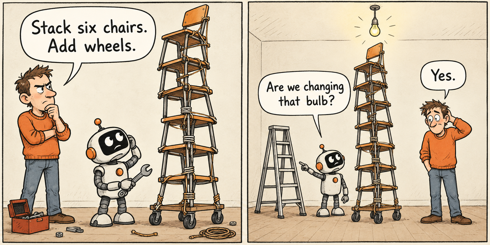

# Express the General

When I ask an AI to do something, I can mix two things: what I want and how I think it should work.

The distinction matters. I might know the result I need but have little knowledge of the best method. If I give the model that method as an instruction, I restrict its choices before it starts.

*An illustrated example: the instructions describe a method but leave the goal unstated.*

This is the problem I mean by *expressing the general*: making my intent clear enough for something outside my own head to act on it.

The name comes from my reading of Kierkegaard's *Fear and Trembling*. His contrast between the single individual and the general gave me a way to think about this problem. I use it here as an analogy.

I have my own context, habits, and reasons. The model does not automatically share them. I need to explain the parts that matter.

That requires more than a short prompt. It requires some judgment about what I know.

Suppose I want a function to be easier to read. I could ask:

> Extract the loop into a helper. Add comments to each step. Avoid early returns.

Those instructions are clear. But they specify a method without explaining the result I want. Perhaps a helper would make the code harder to follow. Perhaps the comments would repeat what the code already says.

A better request could be:

> Refactor this function so a developer unfamiliar with it can follow the logic. Preserve its behavior. It runs frequently, so avoid extra work inside the loop.

Now the model has a goal, an intended reader, and limits. It can choose a method within those limits. I still need to check the result.

The difficulty is deciding which details belong in the request.

Some details describe real requirements. We might need a particular library because the rest of the system uses it. We might need a longer explanation because the reader lacks experience. Those details matter.

Other details are guesses. I might request a library because I remember its name. I might insist on a design because it is the only one I know.

A guess can still help, provided I identify it:

> I think a helper function might make this clearer. Check whether it would help.

This gives the model an option to assess. It does not turn my uncertainty into a rule.

The same distinction applies to context. Previous failures, system behavior, and reasons for decisions can all affect the answer. Removing that information to make a prompt shorter can make the task less clear.

My aim is to provide enough information to explain the task, while keeping requirements separate from assumptions.

This is also how I think about gcontext. A project contains knowledge that its people no longer think to explain. They know why a process exists or why an obvious solution failed before. An agent needs access to that knowledge.

Organizing it makes the project easier to explain. It does not remove the need for judgment, questions, or checks.

For me, writing a prompt starts with three questions: What result do I need? What facts and limits matter? Which instructions are only guesses?

Answering those questions is the work of expressing the general.
