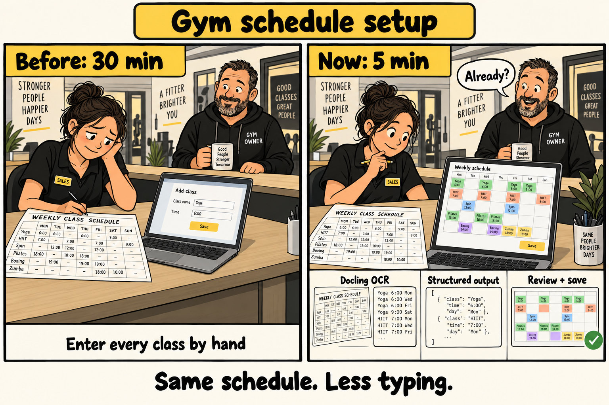
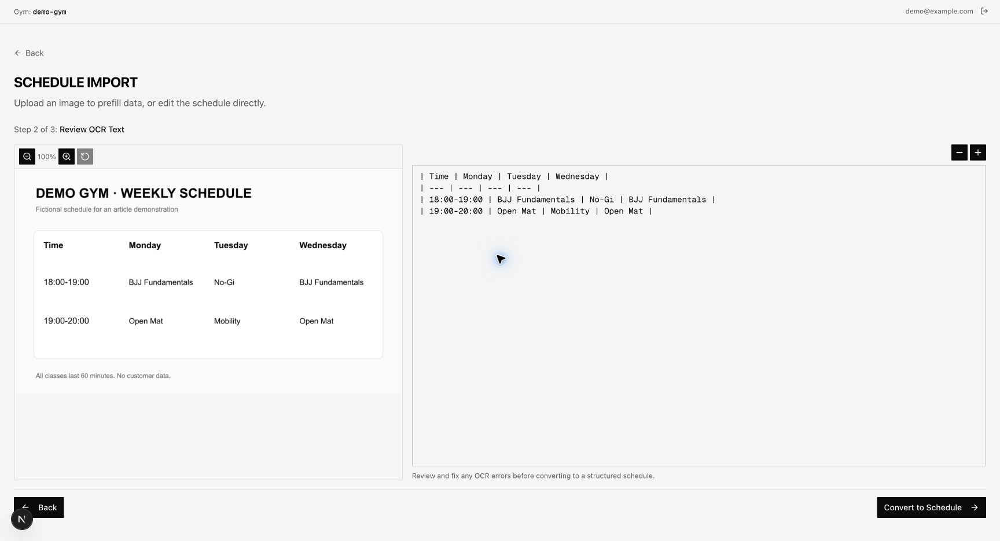
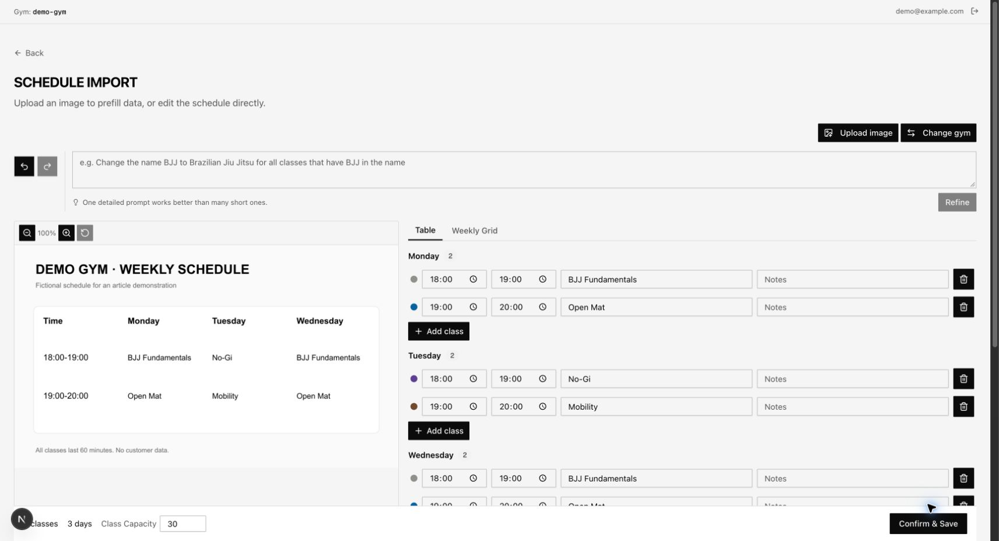

When a new gym joined MAAT, our sales team received a picture of its weekly schedule. Then someone entered every class into the app, one field at a time. A schedule that took seconds to understand could take about 30 minutes to enter.

Our product team built an import tool that reduced this task to about five minutes. The sales team does it around 15-30 times each week, so those 25 minutes matter. At that volume, the reduction represents about 6.25-12.5 hours of work each week.

The solution combines two steps: read the image into an editable table, then convert that table into the data MAAT needs. That table also gives the team a place to correct errors before they reach the schedule.

## The picture already had the information

The problem was familiar to our onboarding team. A gym sent its schedule, but MAAT needed the day, class name, start time, and end time in separate fields. Someone had to copy those details for every class, then repeat the process for the next gym.



Illustration of schedule setup, from about 30 minutes to five minutes for our sales team. People, schedules, and interface drawings are fictional.

We decided to build the solution inside our internal tool, where the team could upload the picture and check the result. The aim was to reduce the repeated entry while keeping the schedule easy to inspect.

## We divided the work to reduce the cost

We considered a more capable model that could convert the image directly to JSON, a data format that software can read. For the schedules we measured at the time, that approach cost about EUR 0.20-0.50 per image.

Instead, we used Docling on Modal to convert the image into Markdown, which represents tables as plain text. Docling reads the document, and Modal runs the service for us. This step cost about EUR 0.01-0.02 per image in our measurements.

We then used Gemini 2.5 Flash-Lite to convert the Markdown into structured schedule data. The cost of this second step was negligible in our measurements. These figures describe our costs at the time, rather than current prices for every possible schedule.

This choice also gave us a useful review point. The team could inspect the text before conversion, instead of correcting everything only after the model produced the final fields.

## The team checks the table before conversion

The internal tool displays the Markdown beside the original picture. The team checks the class names and times, corrects any reading errors, then selects Convert to Schedule.



Staged frontend view with fictional data. We supplied the image and Markdown in a temporary local copy. We did not execute OCR for this capture.

The backend sends the checked text to Gemini and requests the fields that our schedule needs. A class from the fictional example becomes this record:

```json
{
  "name": "Monday",
  "classes": [
    {
      "time": "18:00",
      "endTime": "19:00",
      "name": "BJJ Fundamentals"
    }
  ]
}
```

We simplified this example. The frontend also assigns an identifier to each class. The parsing prompt converts day names to English but keeps class names and notes in their original language.

The team then checks the result in an editable table or a weekly grid. The tool also warns about time overlaps. Review still matters: when the text contains no end time, the prompt asks the model to estimate a one-hour duration.



Staged frontend view with fictional data. The real frontend used a local mock response for the conversion. We did not save this schedule.

For our sales team, this changed the task from entering every class to checking and correcting a proposed schedule. The team still controls what it saves to MAAT.

## Difficult pictures can still use the same text step

Docling did not correctly read every schedule. In those cases, we could use our Claude or OpenAI subscription to read the picture, then paste the resulting table into the Markdown editor. The text-to-JSON step still worked from that replacement text.

The subscription has its own cost, outside the EUR 0.01-0.02 figure for our normal image step. But the team could still use the rest of the tool instead of returning to manual class entry.

The editable table made this possible. We could change how we read a difficult image without changing how we converted its text into schedule data. For a similar task, that is a useful place to start: find the point where a person can inspect and correct the result.
