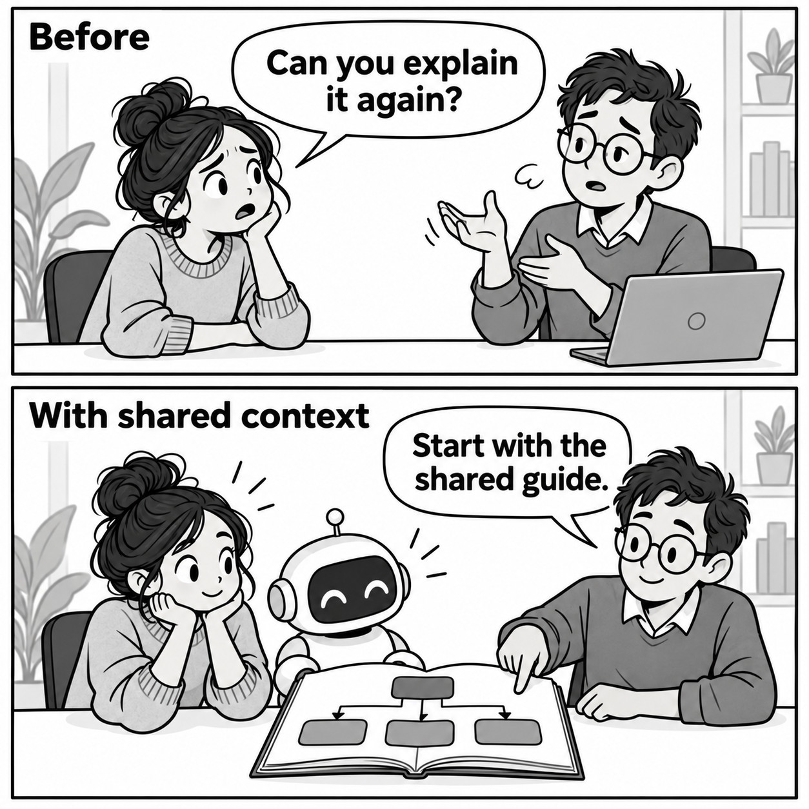

At MAAT, we build an AI Brain that the team can use for questions, support, and migrations. We chose a shared structure for our company context that both people and AI can follow.

This article explains the problem, the tools we had, and how we combined them. The code and diagrams below are simplified examples. They do not reproduce our internal files or support procedures.

<figure class="brain-comic" id="shared-context-comic">

<figcaption>A fictional example: the team and AI can start from the same instructions.</figcaption>
</figure>

## What problem did we have?

### Knowledge was spread across people and files

To do a task, you need more than its data. You need the rules, the relevant services, and the exceptions. When that context is in different places, someone must collect it for each task.

<figure class="brain-figure">
<div class="brain-fragments" role="img" aria-label="People know the exceptions. Documents explain the rules. Services hold current data. A team member must bring them together to do a task.">
<div class="brain-fragment-row"><div><strong>People</strong><span>Exceptions</span></div><div><strong>Documents</strong><span>Rules</span></div><div><strong>Services</strong><span>Current data</span></div></div>
<div class="brain-join" aria-hidden="true">↓</div><div class="brain-fragment-result">Someone must connect the pieces<br/><small>Each time the task comes up.</small></div>
</div>
<figcaption>The problem: the information exists, but the path through it needs work.</figcaption>
</figure>

### Access alone did not explain our work

An AI with access to Stripe can retrieve payment information. That access does not explain how our team should handle a request.

We wanted developers to ask questions and support staff to use approved procedures. We also wanted to reuse context during migrations. These uses needed a shared source of knowledge.

## Which tools could help?

### AI could work through a task

An AI assistant can interpret a question, read instructions, and use tools. It needs context to connect those abilities to the way a company works.

### Files could hold the knowledge

Markdown gives people and AI a readable format. Folders organize the files into a hierarchy. Git records changes so the team can review how instructions change.

### Connections could bring in current facts

Connections give the assistant access to relevant services. MCP, a protocol for exposing tools to AI clients, gives different clients a common way to reach the Brain.

These are the building blocks in our approach. Each has a different job:

| Tool | Its job |
| --- | --- |
| AI assistant | Interpret the request and follow instructions |
| Markdown and folders | Store knowledge in a readable hierarchy |
| Git | Record and review changes |
| MCP | Expose the Brain's tools to AI clients |
| Service connections | Read current information and support allowed actions |

The missing piece was deciding how these tools should share context.

## How did we build shared context?

### We designed the hierarchy by hand

We defined the main folders, modules, connections, and their relationships. This is what we mean by building the context manually. AI can help write files. We decide where knowledge belongs and how it connects.

A small example:

```text
brain/
├── index.md
├── connections/
│   ├── index.md
│   └── stripe.md
└── modules/
    ├── index.md
    ├── support/
    │   ├── index.md
    │   └── invoice-copy.md
    └── migrations/
        └── index.md
```

### Each index explains the next step

An index lists links to files with a description of each file. A person and an AI can follow the same links.

Example root `index.md`:

```markdown
# Shared context

- [Connections](connections/index.md):
  How to use external services.
- [Work modules](modules/index.md):
  Knowledge and procedures for each area of work.
```

A support index can then point to a specific procedure:

```markdown
# Support

- [Invoice copy](invoice-copy.md):
  Handle a request for an existing invoice.
  Includes checks and conditions for asking for help.
```

### Procedures link to shared instructions

The procedure explains the work. The connection file explains the service. Linking them lets several tasks reuse one maintained explanation.

<figure class="brain-figure">
<div class="brain-map" role="img" aria-label="A support procedure refers to two inputs: connection instructions for using Stripe and current service data for checking this request.">
<div class="brain-map-root">Support procedure<span>What should we do?</span></div>
<div class="brain-map-branches">
<div class="brain-map-branch"><strong>Connection guide</strong><span>How to use the service</span><div class="brain-map-leaf">Stripe instructions</div></div>
<div class="brain-map-branch"><strong>Live service</strong><span>What is true now</span><div class="brain-map-leaf">Current invoice data</div></div>
</div>
</div>
<figcaption>Keep reusable instructions separate from facts that can change.</figcaption>
</figure>

For a fictional invoice request, a procedure could look like this:

```markdown
# Provide an invoice copy

## Applies when
The customer requests an existing invoice.

## Read first
Use ../../connections/stripe.md for service access.

## Check
Confirm the account and the requested invoice.
Use current data from the service.

## Stop when
The account is unclear or the request needs a change.
Ask the responsible person to decide.

## Complete
Use the approved delivery method.
Verify the result before reporting success.
```

This example shows the shape of an instruction, not a production workflow. Approval of a procedure does not grant every user access to every action.

## What does the Brain let us do?

### Different roles use the same context

The team reaches the Brain through an AI client. The Brain provides the shared knowledge and tools needed for the task.

<figure class="brain-figure">
<div class="brain-fragments" role="img" aria-label="Developers ask questions, support staff use approved procedures, and migration work follows guides. Each reaches shared context and tools through an AI client.">
<div class="brain-fragment-row"><div><strong>Developers</strong><span>Questions</span></div><div><strong>Support</strong><span>Approved tasks</span></div><div><strong>Migrations</strong><span>Guided work</span></div></div>
<div class="brain-join" aria-hidden="true">↓</div><div class="brain-fragment-result">AI client</div><div class="brain-join" aria-hidden="true">↓</div><div class="brain-map-root">MAAT Brain<span>Shared context + tools</span></div>
</div>
<figcaption>A view of the method, not a diagram of MAAT's internal infrastructure.</figcaption>
</figure>

### An approved task becomes reusable

Once we approve a support procedure, other team members can use it with AI help. The person who first solved the problem does not have to explain the whole method again.

For the fictional invoice example, the path is:

```text
"Can we provide this invoice again?"
                 ↓
        Read the shared index
                 ↓
        Find the support procedure
                 ↓
        Check current service data
                 ↓
        Does the request fit?
          /              \
        Yes               No
         ↓                 ↓
  Use allowed steps    Ask for help
         ↓
  Verify the result
```

### Growing the knowledge is still hard

The first structure gives us a starting point. We still need to make it possible to add knowledge at a larger scale. We must avoid duplicates, find the right home for a lesson, and check whether it applies beyond one case.

<figure class="brain-figure">
<div class="brain-growth" role="img" aria-label="A new lesson needs review for accuracy, scope, and location before it becomes shared context.">
<div>New lesson</div><span aria-hidden="true">↓</span><div class="brain-growth-review"><strong>Review</strong><small>Is it correct?<br/>Where does it apply?<br/>Where does it belong?</small></div><span aria-hidden="true">↓</span><div>Shared context</div>
</div>
<figcaption>This review step still needs human judgment. Knowledge growth is not automatic.</figcaption>
</figure>

AI can help prepare updates and find related files. We still need to decide what should become shared knowledge. We need a way to add more knowledge and keep it clear enough for people and AI to use.
